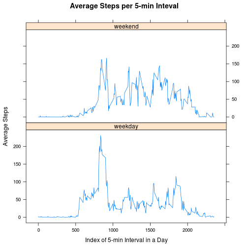

This is an R Markdown document for Project 1 of Coursera's "Reproducible Research" Course.

**Load all required libraries**  

```r
require(knitr)
require(lattice)
```

```
## Loading required package: lattice
```
Set Global Options: echo=TRUE

```r
opts_chunk$set(echo=TRUE)
```

**Load and preprocess data**  
Read the data into a data frame and transform the data for further analysis. Data is assumed to be in current directory.

```r
# Read the data
activity<-read.csv("activity.csv",stringsAsFactors=FALSE)
# Change the date from string to date object
activity$date=as.Date(activity$date,"%Y-%m-%d")
# Aggregate into total steps per day
steps_by_date<- aggregate(steps~date, data=activity, FUN=sum)
mean_by_period<-aggregate(steps~interval, data=activity, FUN=mean, na.rm=TRUE)
```

**Compute the mean and median total number of steps per day**  
Draw a histogram of frequency of steps per day

```r
hist(steps_by_date$steps,xlab="Total Number of Steps", 
     main="Histogram of Total Number of Steps per Day")
```

 

Report the mean and median steps per day

```r
mean_steps <- mean(steps_by_date$steps)
median_steps <- median(steps_by_date$steps)
```

Mean of Total Steps per Day: 10766.19  
Median of Total Steps per Day: 10765.00

**Plot average daily activity pattern**  
**Note:** In the plot below, the x-axis number represents the index of each 5 minute interval in a day.
      For example: 0 means 0 - 4 min, 1 means 5 - 9 min and so on

```r
plot(mean_by_period$steps,type='l', 
     xlab='Index of 5-min Interval in a Day', 
     ylab='Average steps in each 5-min Interval')
```

 

Report the maximum number of steps in a 5-min interval

```r
max_steps <- mean_by_period[which.max(mean_by_period$steps),]$interval
```
Max steps in a 5 minute interval in a day is: 835


**Impute Missing Data.**  

```r
na_count <- sum(is.na(activity))
```
The number of rows with NA in the steps column is: 2304

In this case, I have chosen to replace the NA data with the mean for that period from all days.

```r
# Replicate mean_by_period$steps by the number of times (61 in this case)
# such that a mean for that period is created for every row in "activity"
# dataset
num_rep <- nrow(activity)/nrow(mean_by_period)
steps_by_period_rep <- rep(mean_by_period$steps, num_rep)

# Create a new dataset and get the index of all rows with NA in them
# and set the NA equal to the mean for that period
activity_nona <- activity
na_rows<-which(is.na(activity_nona))
activity_nona$steps[na_rows]<-steps_by_period_rep[na_rows]
```

Histogram of frequency of steps per day. This is using the fixed up data with no NAs

```r
# Create a hist of total steps per day with imputed NA values
steps_by_date_nona<- aggregate(steps~date, data=activity_nona, FUN=sum)
hist(steps_by_date_nona$steps,xlab="Total Number of Steps", 
     main="Histogram of Total Number of Steps per Day (Imputed NA Values)")
```

 


```r
# Find out the mean and median with imputed NA values
mean_steps_nona <- mean(steps_by_date_nona$steps)
median_steps_nona <- median(steps_by_date_nona$steps)
```
Mean of Total Steps per Day (imputed NA): 10766.19  
Median of Total Steps per Day (imputed NA): 10766.19

**From the above data, it can be seen that the mean and median change very little with NAs in the data and with imputed NAs.**  
**In fact the mean is the same between data with and without NA and the median changes slightly.**

**Difference in activity between weekend and weekdays**  
Compute and plot the difference


```r
# Create a new factor variable for weekend or weekday using 'weekdays'
activity_nona$daytype<-as.factor(ifelse(weekdays(activity_nona$date) 
                                        %in% c('Saturday','Sunday'), 'weekend', 'weekday'))

# Create a panel plot of avg steps across 5-min interval on weekdays and weekends
# Get data into the right format for a lattice xyplot
tmpa<-aggregate(steps~interval, data=activity_nona[activity_nona$daytype=='weekday',], 
                FUN=mean)
colnames(tmpa)[2]<-'weekday'

mean_by_period_daytype<-aggregate(steps~interval, 
                                  data=activity_nona[activity_nona$daytype=='weekend',], 
                                  FUN=mean)
colnames(mean_by_period_daytype)[2]<-'weekend'
mean_by_period_daytype$weekday<-tmpa$weekday

xyplot(weekday+weekend~interval, data=mean_by_period_daytype, 
       layout=c(1,2),type='l',outer=TRUE, xlab='Index of 5-min Interval in a Day', 
       ylab='Average Steps', main='Average Steps per 5-min Inteval')
```

 

It can be seen that the activity is indeed different between weekend and weekdays.  
More steps are taken on averate during the early part of the day during weekdays.
